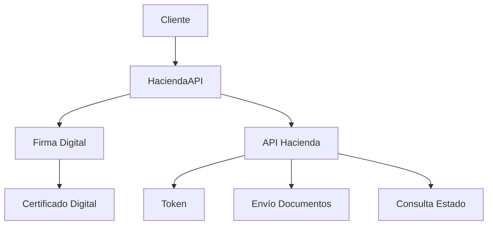
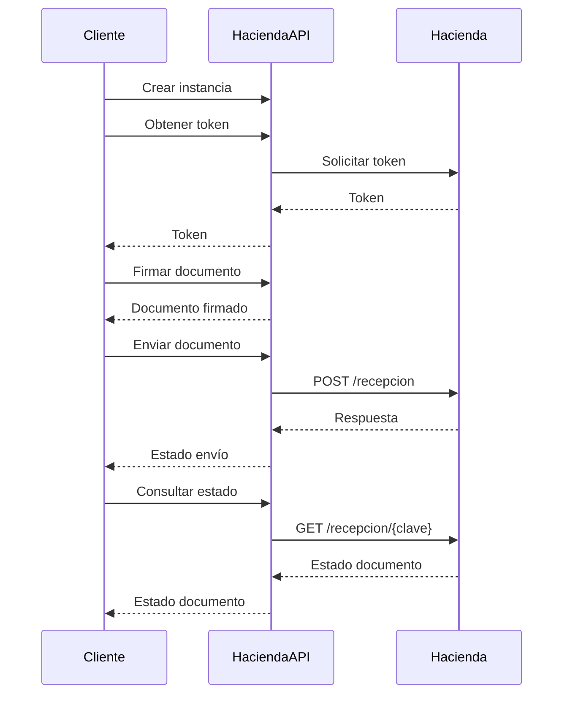

# @cuyware/hacienda-js

Biblioteca TypeScript para facturación electrónica de Costa Rica (Ministerio de Hacienda).

## Características

- ✅ Firma digital de documentos XML
- ✅ Soporte para certificados .p12 y .pem
- ✅ Envío de documentos al API de Hacienda
- ✅ Consulta de estado de documentos
- ✅ Soporte para ambientes de desarrollo y producción
- ✅ TypeScript con tipos estrictos
- ✅ Compatible con Node.js, Vite y frameworks modernos

## Arquitectura



### Componentes Principales

1. **HaciendaAPI**: Clase principal que maneja la comunicación con el API de Hacienda
   - Gestión de tokens
   - Envío de documentos
   - Consulta de estado

2. **Firma Digital**: Módulo para firmar documentos XML
   - Soporte para certificados P12 y PEM
   - Validación de certificados
   - Manejo de errores

3. **XML**: Utilidades para manejo de documentos XML
   - Validación de estructura
   - Transformación de datos

## Requisitos

- Node.js 14.x o superior
- npm 6.x o superior

## Instalación

```bash
# Usando npm
npm install @cuyware/hacienda-js

# Usando yarn
yarn add @cuyware/hacienda-js

# Usando pnpm
pnpm add @cuyware/hacienda-js
```

## Configuración del Proyecto

1. Instalar dependencias:
```bash
npm install
```

2. Compilar el proyecto:
```bash
npm run build
```

3. Ejecutar pruebas:
```bash
npm test
```

## Guía de Uso

### 1. Configuración Inicial

```typescript
import { HaciendaAPI, signXml } from '@cuyware/hacienda-js';

// Crear instancia del API
const api = new HaciendaAPI({
  apiUrl: 'https://api.hacienda.go.cr/fe/ae',
  clientId: 'api-stag',
  environment: 'desarrollo' // o 'produccion'
});
```

### 2. Autenticación

```typescript
// Obtener token de acceso
const token = await api.getToken('usuario@ejemplo.com', 'contraseña');
```

### 3. Firma Digital

```typescript
// Firmar documento XML
const signedXml = await signXml(facturaXml, {
  certPath: './certificado.p12', // o './certificado.pem'
  password: 'contraseña-del-certificado',
  certType: 'p12' // o 'pem'
});
```

### 4. Envío de Documentos

```typescript
// Enviar documento a Hacienda
const response = await api.sendDocument(signedXml, token);

// Consultar estado
const status = await api.checkStatus(response.clave, token);
```

### Manejo de Errores

```typescript
try {
  const signedXml = await signXml(facturaXml, options);
} catch (error) {
  if (error.message === 'Invalid certificate type') {
    // Manejar error de tipo de certificado inválido
  } else if (error.message === 'File not found') {
    // Manejar error de archivo no encontrado
  }
}
```

## Estructura del Proyecto

```
hacienda-js/
├── src/
│   ├── api/        # Comunicación con API de Hacienda
│   ├── signature/  # Firma digital de documentos
│   ├── types/     # Definiciones de tipos TypeScript
│   ├── xml/       # Utilidades para manejo de XML
│   └── __tests__/ # Pruebas unitarias
├── dist/          # Código compilado
├── examples/      # Ejemplos de uso
└── docs/          # Documentación adicional
```

## Dependencias Principales

- `xml-crypto`: Firma digital de documentos XML
- `axios`: Cliente HTTP para comunicación con API
- `typescript`: Soporte para tipos estáticos
- `jest`: Framework de pruebas

## Documentación Adicional

- [Guía de Firma Digital](./docs/firma-digital.md)
- [API de Hacienda](./docs/api-hacienda.md)
- [Ejemplos Completos](./examples/)

## Pruebas

```bash
# Ejecutar todas las pruebas
npm test

# Ver cobertura de pruebas
npm run test:coverage

# Ejecutar pruebas en modo watch
npm run test:watch
```

## Flujo de Trabajo



## Licencia

Este proyecto está bajo la Licencia MIT - vea el archivo [LICENSE](LICENSE) para más detalles.

La Licencia MIT es una licencia de software permisiva que permite:

✅ Uso comercial
✅ Modificación
✅ Distribución
✅ Uso privado

Sin ninguna garantía y con la única obligación de incluir la nota de copyright y la licencia en cualquier copia del software/código.

Esto significa que puedes:
- Usar este software en proyectos comerciales
- Modificar el código fuente
- Distribuir el software original o modificado
- Incluirlo como dependencia en tu proyecto

Solo necesitas mantener el aviso de copyright y la licencia en cualquier copia o parte sustancial del software.

## Contribuir

1. Fork el repositorio
2. Crea una rama para tu feature (`git checkout -b feature/amazing-feature`)
3. Commit tus cambios (`git commit -m 'Add amazing feature'`)
4. Push a la rama (`git push origin feature/amazing-feature`)
5. Abre un Pull Request

## Soporte

Si encuentras un bug o tienes una sugerencia, por favor abre un issue en el repositorio.
